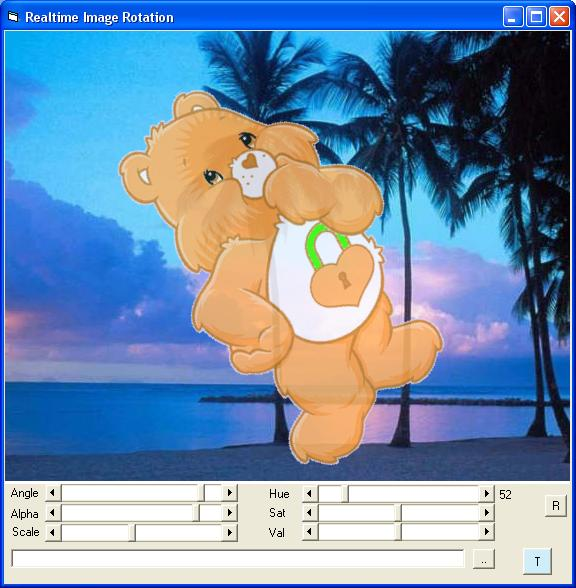

<div align="center">

## Realtime Image Rotation using C dll


</div>

### Description

Rotate a picture at any given angle in realtime. Also scale it, use transparent color, alphablending and hue change. Uses a C dll source included.

For the compiled dll:

http://www2.cs.ucy.ac.cy/~cs06ee1/rotatedll.zip

*UPDATE: 22/7/2010 Fixed memory leak*
 
### More Info
 


<span>             |<span>
---                |---
**Submitted On**   |2010-07-21 21:20:04
**By**             |[Lefteris Eleftheriades](https://github.com/Planet-Source-Code/PSCIndex/blob/master/ByAuthor/lefteris-eleftheriades.md)
**Level**          |Intermediate
**User Rating**    |5.0 (45 globes from 9 users)
**Compatibility**  |VB 5\.0, VB 6\.0
**Category**       |[Graphics](https://github.com/Planet-Source-Code/PSCIndex/blob/master/ByCategory/graphics__1-46.md)
**World**          |[Visual Basic](https://github.com/Planet-Source-Code/PSCIndex/blob/master/ByWorld/visual-basic.md)
**Archive File**   |[Realtime\_I2185117212010\.zip](https://github.com/Planet-Source-Code/lefteris-eleftheriades-realtime-image-rotation-using-c-dll__1-67981/archive/master.zip)

### API Declarations

```
Private Declare Function rotatedc Lib "rotate.dll" Alias "rotatedc" (ByVal aHDC As Long, ByVal Angle As Single, ByVal X As Long, ByVal Y As Long, ByVal W As Long, ByVal H As Long, ByVal hBitmap As Long, ByVal pScale As Single, ByVal TraspColor As Long, ByVal Alpha As Single) As Long
```


